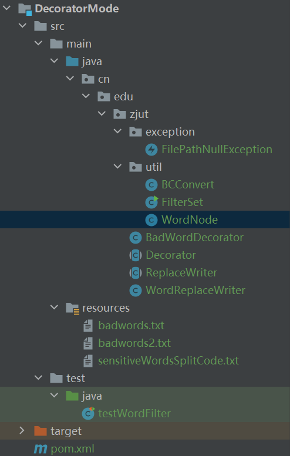
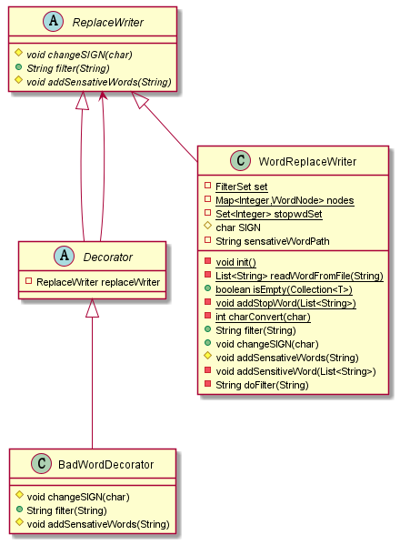
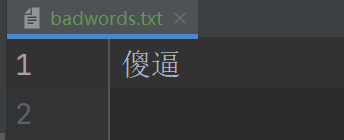
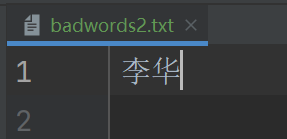
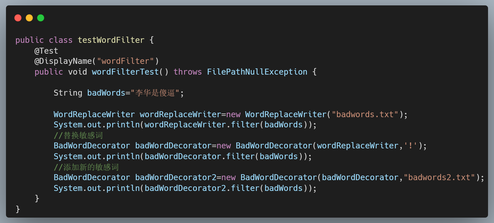
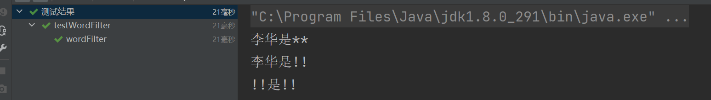
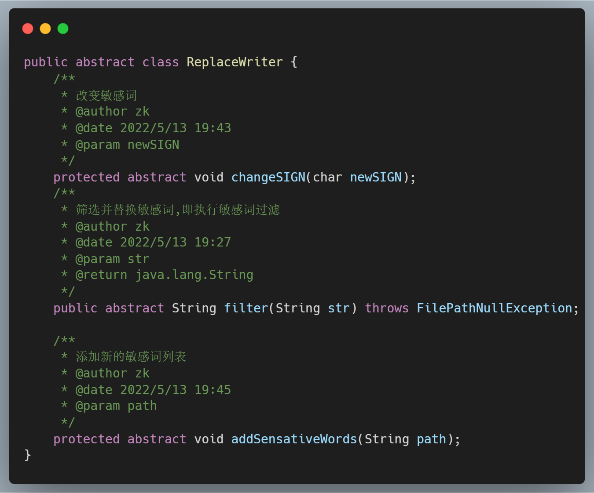
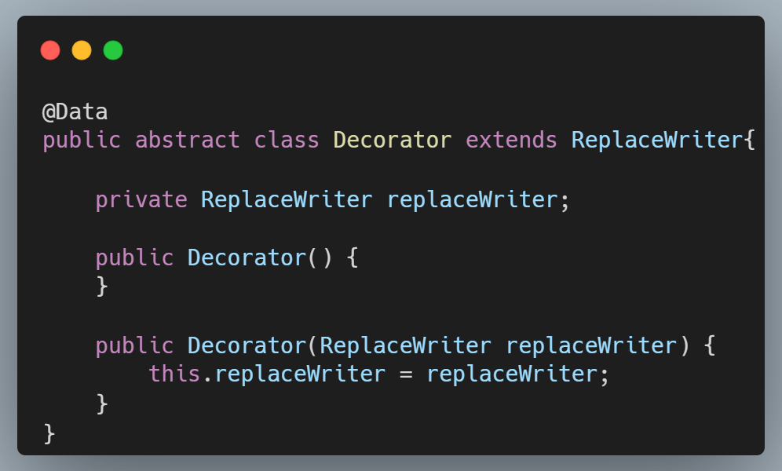
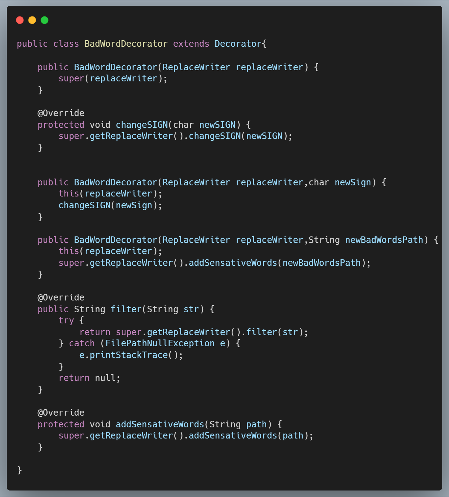

# 一、设计问题

在论坛中为了防止用户发表不雅言论，常常需要将某些敏感词汇屏蔽。假设某论坛是将发帖内容保存在磁盘文件中，请利用装饰模式的概念编写一个过滤流类ReplaceWriter，使用该类的Write字符串系列方法会将敏感词汇用“\*”替换掉。需要替换的敏感词汇保存在文件badwords.txt中。请按实验的要求提交实验报告和项目实现的源代码。（提示：参考FilterWriter)

# 二、问题分析与模式选用

本问题其实是多例模式的使用也即单例模式的拓展，用多个线程竞争性的获取有限个的类实例。单例模式中，这个类的实例永远都是一个；但是在程序运行过程中，为了达到复用的效果，需要在一个池子中去选择对应的实例进行使用，这个时候多例模式也就应运而生了。本问题的多例模式类实际上设计并不困难，但是考虑到多线程，需要使用到synchronized和一些线程安全的数据结构，以及合理使用线程池等。因为cfg文件每次读取失败，原因也查不到，而且当下流行的配置文件都是xml，yml，properties等文件格式，所以这里的cfg文件配置的多例模式个数上线就直接写在了类里面。

# 三、设计方案

项目结构如下

总共四个类装饰模式相关的类,三个工具类和一个异常类，其中实现装饰模式模式的设计模式UML图如下

# 四、运行结果及效果分析

敏感词文本有两个

分别是

和

运行代码如下

上诉代码三个功能分别为读入第一个敏感词文本文件,替换成新的敏感词文本,追加新的敏感词文本文件

输出结果如下

# 五、关键代码（算法）及其说明

## 基础类ReplaceWriter

## 文本替换类WordReplaceWriter

@Data

@NoArgsConstructor

public class WordReplaceWriter extends ReplaceWriter{

/\*\*

\* 存储首字

\*/

private static final FilterSet set = new FilterSet();

/\*\*

\* 存储节点

\*/

private static final Map\<Integer, WordNode\> nodes = new HashMap\<Integer, WordNode\>(1024, 1);

/\*\*

\* 停顿词

\*/

private static final Set\<Integer\> stopwdSet = new HashSet\<\>();

static {

try {

init();

} catch (Exception e) {

// 加载失败

}

}

/\*\*

\* 初始化

\* @author zk

\* @date 2022/5/13 18:40

\*/

private static void init() {

// 获取停顿词

addStopWord(readWordFromFile("sensitiveWordsSplitCode.txt"));

}

/\*\*

\* 从recourse文件夹下按行读取文件并返回List集合

\* @author zk

\* @date 2022/5/13 18:41

\* @param path

\* @return java.util.List\<java.lang.String\>

\*/

private static List\<String\> readWordFromFile(String path) {

List\<String\> words;

BufferedReader br = null;

try {

br = new BufferedReader(new InputStreamReader(WordReplaceWriter.class.getClassLoader().getResourceAsStream(path)));

words = new ArrayList\<String\>(1200);

for (String buf = ""; (buf = br.readLine()) != null;) {

if (buf == null \|\| "".equals(buf)) {

continue;

}

words.add(buf);

}

} catch (Exception e) {

throw new RuntimeException(e);

} finally {

try {

if (br != null) {

br.close();

}

} catch (IOException e) {

}

}

return words;

}

/\*\*

\* 判断集合是否为空

\* @author zk

\* @date 2022/5/13 18:37

\* @param col

\* @return boolean

\*/

public static \<T\> boolean isEmpty(final Collection\<T\> col) {

return col == null \|\| col.isEmpty();

}

/\*\*

\* 增加停顿词

\* @author zk

\* @date 2022/5/13 18:39

\* @param words

\*/

private static void addStopWord(final List\<String\> words) {

if (!isEmpty(words)) {

char[] chs;

for (String curr : words) {

chs = curr.toCharArray();

for (char c : chs) {

stopwdSet.add(charConvert(c));

}

}

}

}

/\*\*

\* 大/小写,全/半角转换

\* @author zk

\* @date 2022/5/13 18:39

\* @param src

\* @return int

\*/

private static int charConvert(char src) {

int r = BCConvert.qj2bj(src);

return (r \>= 'A' && r \<= 'Z') ? r + 32 : r;

}

/\*\*

\* 敏感词替换后的词

\*/

protected char SIGN='@';

/\*\*

\* 敏感词文件路径

\*/

private String sensativeWordPath;

@Override

public String filter(String str) throws FilePathNullException {

if(sensativeWordPath==null){

throw new FilePathNullException("敏感词文本文件未加载");

}

return doFilter(str);

}

@Override

public void changeSIGN(char newSIGN){

SIGN=newSIGN;

}

@Override

protected void addSensativeWords(String path) {

addSensitiveWord(readWordFromFile(path));

}

/\*\*

\* 增加敏感词,DFA算法

\* @author zk

\* @date 2022/5/13 18:46

\* @param words

\*/

private void addSensitiveWord(final List\<String\> words) {

if(isEmpty(words)){

System.out.println("words为空");

}

if (!isEmpty(words)) {

char[] chs;

int fchar;

int lastIndex;

WordNode fnode; // 首字母节点

for (String curr : words) {

chs = curr.toCharArray();

fchar = charConvert(chs[0]);

if (!set.contains(fchar)) {// 没有首字定义

set.add(fchar);// 首字标志位 可重复add,反正判断了，不重复了

fnode = new WordNode(fchar, chs.length == 1);

nodes.put(fchar, fnode);

} else {

fnode = nodes.get(fchar);

if (!fnode.isLast() && chs.length == 1) {

fnode.setLast(true);

}

}

lastIndex = chs.length - 1;

for (int i = 1; i \< chs.length; i++) {

fnode = fnode.addIfNoExist(charConvert(chs[i]), i == lastIndex);

}

}

}

}

/\*\*

\* DFA算法敏感词过滤

\* @param src

\* @return

\*/

private final String doFilter(final String src) {

if (set != null && nodes != null) {

char[] chs = src.toCharArray();

int length = chs.length;

int currc; // 当前检查的字符

int cpcurrc; // 当前检查字符的备份

int k;

WordNode node;

for (int i = 0; i \< length; i++) {

currc = charConvert(chs[i]);

if (!set.contains(currc)) {

continue;

}

node = nodes.get(currc);// 日 2

if (node == null) {

continue;

}

boolean couldMark = false;

int markNum = -1;

if (node.isLast()) {// 单字匹配（日）

couldMark = true;

markNum = 0;

}

// 继续匹配（日你/日你妹），以长的优先

// 你-3 妹-4 夫-5

k = i;

cpcurrc = currc; // 当前字符的拷贝

for (; ++k \< length;) {

int temp = charConvert(chs[k]);

if (temp == cpcurrc) {

continue;

}

if (stopwdSet != null && stopwdSet.contains(temp)) {

continue;

}

node = node.querySub(temp);

if (node == null)// 没有了

{

break;

}

if (node.isLast()) {

couldMark = true;

markNum = k - i;// 3-2

}

cpcurrc = temp;

}

if (couldMark) {

for (k = 0; k \<= markNum; k++) {

chs[k + i] = SIGN;

}

i = i + markNum;

}

}

return new String(chs);

}

return src;

}

public WordReplaceWriter(String sensativeWordPath) {

this(sensativeWordPath,'\*');

}

public WordReplaceWriter(String sensativeWordPath, char SIGN) {

this.sensativeWordPath = sensativeWordPath;

this.SIGN = SIGN;

addSensitiveWord(readWordFromFile(sensativeWordPath));

}

}

## 装饰模式基础类Decorator

## 装饰模式实现类

