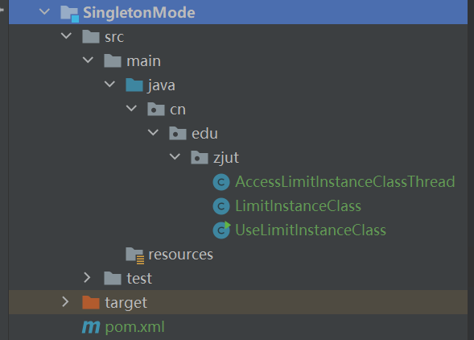
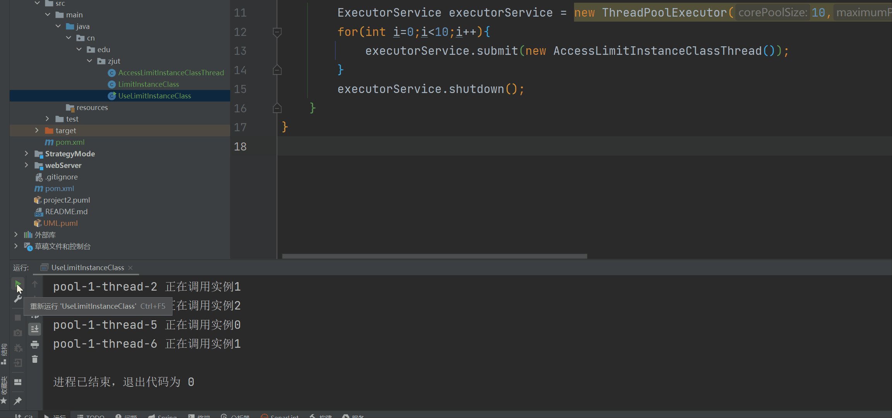

# 一、设计问题

单例模式的扩展及应用。

## 编写一个类LimitInstanceClass

该类最多可以实例化指定个数实例。

1.  实例的个数用配置文件InstanceLimit.cfg指定。例如，如果InstanceLimit.cfg的内容为2，则LimitInstanceClass最多可以同时存在2个对象。
2.  LimitInstanceClass的对象如下:
3.  有一个整型成员变量id，保存对象的编号；
4.  有一个boolean型变量isBusy，如果该变量的值为true，表示该对象正在被使用，否则该对象空闲。
5.  getInstance()方法判断是否存在空闲的对象，存在将该空闲对象的isBusy置为true，并返回该对象；如果不存在空闲对象则返回null。
6.  有一个release()方法，该方法将对象的isBusy置为false。
7.  还有一个String类型的成员变量accessMessage，以及一个成员方法writeAccessMessage(String message)，该方法将参数message追加到accessMessage
8.  printAccessMessage()方法输出accessMessage的内容。

## 编写一个线程类AccessLimitInstanceClassThread，

在其run()方法中获取一个LimitInstanceClass对象，调用获得的对象的writeAccessMessage(String message)将自己的线程名写入accessMessage，随机休眠0-5秒，再调用printAccessMessage()，最后调用release（）方法。

## 编写一个UseLimitInstanceClass类

在其main方法中实例化10个AccessLimitInstanceClassThread线程对象，并启动各个线程。设置InstanceLimit.cfg的内容为3，写出你的程序的运行结果。

# 二、问题分析与模式选用

本问题其实是多例模式的使用也即单例模式的拓展，用多个线程竞争性的获取有限个的类实例。单例模式中，这个类的实例永远都是一个；但是在程序运行过程中，为了达到复用的效果，需要在一个池子中去选择对应的实例进行使用，这个时候多例模式也就应运而生了。本问题的多例模式类实际上设计并不困难，但是考虑到多线程，需要使用到synchronized和一些线程安全的数据结构，以及合理使用线程池等。因为cfg文件每次读取失败，原因也查不到，而且当下流行的配置文件都是xml，yml，properties等文件格式，所以这里的cfg文件配置的多例模式个数上线就直接写在了类里面。

# 三、设计方案

项目结构如下

总共三个类，其中实现多例模式的设计模式UML图如下

主要由LimitInstanceClass组成。

另外的AccessLimitInstanceClassThread和UseLimitInstanceClass分别是基础线程类和程序运行类

# 四、运行结果及效果分析

输出结果如下

GIF图如下

# 五、关键代码（算法）及其说明

## LimitInstanceClass

## AccessLimitInstanceClassThread

## UseLimitInstanceClass

