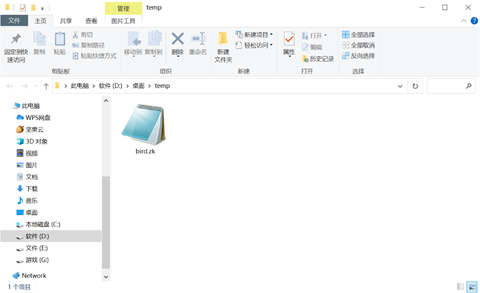

# 策略模式--加密解密文件

## **一、设计问题**

​     设计一个文件加密解密软件，加密后将原始文件删除，只保留加密后的文件；解密则恢复原始文件，删除加密后的文件。要求可以选择不同的加解密算法，并且可以增加加解密算法而不需要修改原有代码。修改已有的加解密算法也不需要修改其他代码。请给出设计方案，并用Java加以实现。

说明：1.自查资料，至少实现两种以上的加解密算法，也可以是自己设计的算法。

​     2.加密后的文件可以通过自设的扩展名让程序识别是否是加密后文件以及使用的加密算法。

## **二、问题分析与模式选用**

对设计问题进行分析，选择需要应用的设计模式并说明理由，画出相应设计模式的UML类图（可用Rational rose、viso或其他绘图软件）。

   UML类图如下

​                               

   设计模式采用策略模式,因为EncodingContext类定义了多种行为,并且这些行为在这个类的方法中本来以多个条件语句的形式出现,如果使用策略模式,就避免在使用大量的条件语句。其次,程序不希望暴露复杂的、与算法相关的数据结构,那么可以使用策略模式封装算法,因此在程序中需要使用一个算法的不同变体EncryptStrategy接口,并用子接口实现不同的加密算法。

## **三、设计方案**

给出对设计问题的具体设计方案，设计方案的UML类图，并加以说明。

UML类图见上文,项目结构如下


1. 实现父接口EncryptStrategy的三个子类分别实现的加密解密算法为RSA非对称加密,AES对称加密和Base64加密算法.另外MyEncrypy视线了我自定义的加密算法.

2. 接着在EncodingContext上下文中利用Java反射来实现类的生成.

3. 在同时自定义了一个FileOperation类用来实现文件的写入读出.

4. 为了实现加密信息的保存,我还创建了Myfile类用于保存1.文件加密类型字段,2. 原文件路径,3. 文件内容,4. 加密解密用秘钥.

5. 为了自定义文件格式的保存,设置如上的类成员变量来实,最终采用序列化的方式写入自定义格式的文件中.

6. 最终采用springboot和thymeleaf实现页面效果

## **四、运行结果及效果分析**

给出主要的运行截图，分析设计达到的效果。

启动webServer主程序

在网页中输入localhost:8080

页面如下

 

点击选择文件按钮,在弹出的文件选择框中选中文件

 

该图片预览如下

 

确认后点击上传按钮

 

稍等片刻后会出现加密文件下载提示

 

记事本打开文件显示内容如下

 

服务器暂存文件的目录在D:/desktop/temp/,预览如下

 



接着上传.zk格式的加密文件来解密


点击上传按钮


服务器返回解密文件

 

读取要加密的文件,返回生成的加密文件路径,然后解密文件.

## **五、关键代码（算法）及其说明**

给出项目实现中的关键代码和说明（通过注释），涉及算法的给出算法描述。

 ASE加密算法如下

 ```java
package com.zjut.util.encrypt.Impl;


import java.io.IOException;
import java.io.UnsupportedEncodingException;
import java.security.InvalidKeyException;
import java.security.NoSuchAlgorithmException;
import java.security.SecureRandom;
import java.util.Scanner;

import javax.crypto.BadPaddingException;
import javax.crypto.Cipher;
import javax.crypto.IllegalBlockSizeException;
import javax.crypto.KeyGenerator;
import javax.crypto.NoSuchPaddingException;
import javax.crypto.SecretKey;
import javax.crypto.spec.SecretKeySpec;

import com.zjut.common.MyFile;
import com.zjut.util.encrypt.EncryptStrategy;
import sun.misc.BASE64Decoder;
import sun.misc.BASE64Encoder;

/**
 * @Author: zk
 * @DateTime: 2022/3/24 17:53
 * @Description: 该类用于 AES加密
 */

public class AESEncrypt implements EncryptStrategy {

    private static final String encodeRules="AES rules";
    SecretKey key;
    private static SecretKey generateAESKey(){
        //1.构造密钥生成器，指定为AES算法,不区分大小写
        KeyGenerator keygen= null;
        try {
            keygen = KeyGenerator.getInstance("AES");
            //2.根据ecnodeRules规则初始化密钥生成器
            //生成一个128位的随机源,根据传入的字节数组
            keygen.init(128, new SecureRandom(encodeRules.getBytes()));
            //3.产生原始对称密钥
            SecretKey original_key=keygen.generateKey();
            //4.获得原始对称密钥的字节数组
            byte [] raw=original_key.getEncoded();
            //5.根据字节数组生成AES密钥
            return new SecretKeySpec(raw, "AES");
        } catch (NoSuchAlgorithmException e) {
            e.printStackTrace();
        }
        return null;
    }
    /**
     * 加密
     * 1.构造密钥生成器
     * 2.根据ecnodeRules规则初始化密钥生成器
     * 3.产生密钥
     * 4.创建和初始化密码器
     * 5.内容加密
     * @author zk
     * @date 2022/3/24 18:09
 	 * @param bytes
	 * @return java.lang.String
     */
    public  byte[] AESEncode(byte[] bytes){
        try {
            key=AESEncrypt.generateAESKey();
            //6.根据指定算法AES自成密码器
            Cipher cipher=Cipher.getInstance("AES");
            //7.初始化密码器，第一个参数为加密(Encrypt_mode)或者解密解密(Decrypt_mode)操作，第二个参数为使用的KEY
            cipher.init(Cipher.ENCRYPT_MODE, key);
            return cipher.doFinal(bytes);
        } catch (NoSuchAlgorithmException e) {
            e.printStackTrace();
        } catch (NoSuchPaddingException e) {
            e.printStackTrace();
        } catch (InvalidKeyException e) {
            e.printStackTrace();
        } catch (IllegalBlockSizeException e) {
            e.printStackTrace();
        } catch (BadPaddingException e) {
            e.printStackTrace();
        }
        return null;
    }

    /**
     * 解密
     * 解密过程：
     * 1.根据指定算法AES自成密码器
     * 2.初始化密码器，第一个参数为加密(Encrypt_mode)或者解密(Decrypt_mode)操作，第二个参数为使用的KEY
     * @author zk
     * @date 2022/3/24 18:11
 	 * @param content
	 * @return java.lang.String
     */
    public  byte[] AESDncode(byte[] content,SecretKey theKey){
        try {
            Cipher cipher=Cipher.getInstance("AES");
            cipher.init(Cipher.DECRYPT_MODE, theKey);
            return cipher.doFinal(content);
        } catch (NoSuchAlgorithmException e) {
            e.printStackTrace();
        } catch (NoSuchPaddingException e) {
            e.printStackTrace();
        } catch (InvalidKeyException e) {
            e.printStackTrace();
        } catch (IllegalBlockSizeException e) {
            e.printStackTrace();
        } catch (BadPaddingException e) {
            e.printStackTrace();
        }
        return null;
    }

    @Override
    public MyFile encryptBytes(byte[] bytes) {
        return new MyFile(EncryptTypeEnum.AESEncrypt,AESEncode(bytes),this.key);
    }

    @Override
    public byte[] decryptBytes(MyFile myFile) {
        return AESDncode(myFile.getFileTxt(), (SecretKey) myFile.getKey());
    }

}

 ```


RSA加密算法

RSA是非对称加密,需要将数据分段加密

 ```java
package com.zjut.util.encrypt.Impl;

import com.zjut.common.MyFile;
import com.zjut.util.encrypt.EncryptStrategy;
import lombok.extern.slf4j.Slf4j;
import org.junit.jupiter.api.Test;

import javax.crypto.BadPaddingException;
import javax.crypto.Cipher;
import javax.crypto.IllegalBlockSizeException;
import javax.crypto.NoSuchPaddingException;
import java.io.ByteArrayOutputStream;
import java.io.File;
import java.io.IOException;
import java.security.*;
import java.security.interfaces.RSAPrivateKey;
import java.security.interfaces.RSAPublicKey;
import java.security.spec.PKCS8EncodedKeySpec;
import java.security.spec.X509EncodedKeySpec;
import java.util.Arrays;

/**
 * @Author: zk
 * @DateTime: 2022/3/23 18:25
 * @Description: 该类用于 RSA加密
 */

public class RSAEncrypt implements EncryptStrategy {

    public static String key="RSA";
    /**
     * 加密用钥匙
     */
    private static final KeyPair keyPair ;

    static {
        keyPair=generateRSAKeyPair(1024);
    }
    //加密不能超过117
    private static final int MAX_ENCRYPT_BLOCK = 117;
    //解密时以128为最大长度
    private static final int MAX_DECRYPT_BLOCK = 128;

    /**
     * 通过指定的密钥长度生成非对称的密钥对,keySize 推荐使用1024,2048 ，不允许低于1024
     *
     * @param keySize
     * @return java.security.KeyPair
     * @author zk
     * @date 2022/3/23 18:55
     */
    public static KeyPair generateRSAKeyPair(int keySize) {
        KeyPair ret = null;
        try {
            //1、准备生成
            KeyPairGenerator generator = KeyPairGenerator.getInstance(key);
            //2、初始化，设置秘钥长度
            generator.initialize(keySize);
            //3、生成，并且返回
            ret = generator.generateKeyPair();
        } catch (NoSuchAlgorithmException e) {
            e.printStackTrace();
        }
        return ret;
    }

    /**
     * RSA 加密
     * @author zk
     * @date 2022/3/23 18:59
     * @param data
     * @param key
     * @return byte[]
     */
    public static byte[] rsaEncrypt(byte[] data, Key key) {
        if (data != null
                && data.length > 0
                && key != null) {
                // 1、创建Cipher 使用RSA
            try {
                Cipher cipher = Cipher.getInstance(RSAEncrypt.key);
                //设置Key
                cipher.init(Cipher.ENCRYPT_MODE, key);
                //分段加密
                return segmentedEncryptionANDDecryption(data, cipher, MAX_ENCRYPT_BLOCK);
            } catch (NoSuchAlgorithmException | IOException | NoSuchPaddingException | InvalidKeyException | BadPaddingException | IllegalBlockSizeException e) {
                e.printStackTrace();
            }
        }
        return null;
    }
    /**
     * RSA 解密
     * @author zk
     * @date 2022/3/23 18:59
     * @param data
     * @param key
     * @return byte[]
     */
    public static byte[] rsaDecrypt(byte[] data ,Key key){
        if (data != null
                && data.length>0
                && key!=null) {
            // 1、创建Cipher 使用RSA
            try {
                Cipher cipher = Cipher.getInstance(RSAEncrypt.key);
                //设置Key
                cipher.init(Cipher.DECRYPT_MODE,key);
                return segmentedEncryptionANDDecryption(data, cipher, MAX_DECRYPT_BLOCK);
            } catch (NoSuchAlgorithmException e) {
                e.printStackTrace();
            } catch (NoSuchPaddingException e) {
                e.printStackTrace();
            } catch (InvalidKeyException e) {
                e.printStackTrace();
            } catch (BadPaddingException e) {
                e.printStackTrace();
            } catch (IllegalBlockSizeException | IOException e) {
                e.printStackTrace();
            }
        }
        return null;
    }

    /**
     * 分段加密解密函数
     * @author zk
     * @date 2022/3/28 12:54
 	 * @param data 待操作的字节数组
 	 * @param cipher 已实例化的Cipher类
 	 * @param maxDecryptBlock 偏移量
	 * @return byte[]
     */
    private static byte[] segmentedEncryptionANDDecryption(byte[] data, Cipher cipher, int maxDecryptBlock) throws IllegalBlockSizeException, BadPaddingException, IOException {
        int inputLen = data.length;
        int offLen = 0;
        int i = 0;
        ByteArrayOutputStream byteArrayOutputStream = new ByteArrayOutputStream();
        while(inputLen - offLen > 0){
            byte[] cache;
            if(inputLen - offLen > maxDecryptBlock){
                cache = cipher.doFinal(data,offLen, maxDecryptBlock);
            }else{
                cache = cipher.doFinal(data,offLen,inputLen - offLen);
            }
            byteArrayOutputStream.write(cache);
            i++;
            offLen = i* maxDecryptBlock;
        }
        byteArrayOutputStream.close();
        return byteArrayOutputStream.toByteArray();
    }

    /**
     * 覆写加密算法,私钥加密公钥解密
     * @author zk
     * @date 2022/3/24 13:52
 	 * @param bytes 待加密字节数组
     */
    @Override
    public MyFile encryptBytes(byte[] bytes) {
        return new MyFile(EncryptTypeEnum.RSAEncrypt,rsaEncrypt(bytes, RSAEncrypt.keyPair.getPrivate()),RSAEncrypt.keyPair);
    }

    /**
     * 覆写解密算法,私钥加密公钥解密
     * @author zk
     * @date 2022/3/24 13:54
 	 * @param myFile
	 * @return byte[]
     */
    @Override
    public byte[] decryptBytes(MyFile myFile) {
        return rsaDecrypt(myFile.getFileTxt(), ((KeyPair) myFile.getKey()).getPublic());
    }
}

 ```

自定义加密算法如下

 ```java
package com.zjut.util.encrypt.Impl;

import com.zjut.common.MyFile;
import com.zjut.util.encrypt.EncryptStrategy;

import java.util.Random;

/**
 * @Author: zk
 * @DateTime: 2022/3/24 22:17
 * @Description: 该类用于 TODO
 */
public class MyEncrypy implements EncryptStrategy {
    @Override
    public MyFile encryptBytes(byte[] bytes) {
        byte key= (byte) (new Random().nextInt(128));
        byte[] result =new byte[bytes.length];
        for(int i=0;i<bytes.length;i++){
            result[i]= (byte) (bytes[i]+key);
        }
        return new MyFile(EncryptTypeEnum.MyEncrypy,result,key);
    }

    @Override
    public byte[] decryptBytes(MyFile myFile) {
        byte key= (byte) myFile.getKey();
        byte[] result =new byte[myFile.getFileTxt().length];
        for(int i=0;i<result.length;i++){
            result[i]= (byte) (myFile.getFileTxt()[i]-key);
        }
        return result;
    }
}

 ```

上述加密算法中用于数据交互的Myfile类如下

 ```java
package com.zjut.common;

import com.zjut.util.encrypt.Impl.EncryptTypeEnum;
import lombok.Data;

import java.io.Serializable;

/**
 * @Author: zk
 * @DateTime: 2022/3/24 10:01
 * @Description: 该类用于 保存文件加密后的信息
 */
@Data
public class MyFile implements Serializable {
    /**
     * 文件加密类型字段
     */
    private EncryptTypeEnum encryptTypeEnum;
    /**
     * 原文件路径
     */
    private String filePath;

    /**
     * 文件内容
     */
    private byte[] fileTxt;

    /**
     * 加密解密用秘钥
     */
    private Object key;

    public MyFile(EncryptTypeEnum encryptTypeEnum, String fileExtension, byte[] fileTxt) {
        this.encryptTypeEnum = encryptTypeEnum;
        this.filePath = fileExtension;
        this.fileTxt = fileTxt;
    }

    public MyFile(EncryptTypeEnum encryptTypeEnum, byte[] fileTxt, Object key) {
        this.encryptTypeEnum = encryptTypeEnum;
        this.fileTxt = fileTxt;
        this.key = key;
    }

    public MyFile(EncryptTypeEnum encryptTypeEnum, byte[] fileTxt) {
        this.encryptTypeEnum = encryptTypeEnum;
        this.fileTxt = fileTxt;
    }
}

 ```

最后EncodingContext上下文类如下

```java
package com.zjut.util;

import com.zjut.common.MyFile;
import com.zjut.util.encrypt.EncryptStrategy;
import com.zjut.util.encrypt.Impl.EncryptTypeEnum;
import com.zjut.util.io.FileOperation;
import lombok.Data;
import org.junit.jupiter.api.Test;

import java.io.File;

/**
 * @Author: zk
 * @DateTime: 2022/3/23 21:55
 * @Description: 该类用于 加密应用类
 */
@Data
public class EncodingContext {
    private EncryptStrategy encryptStrategy;

    /**
     * 加密文件内容并存储
     * @author zk
     * @date 2022/3/24 16:13
 	 * @param fileTXT
 	 * @param encryptTypeEnum
	 * @return com.zjut.common.MyFile
     */
    public MyFile encryptTxt(byte[] fileTXT, EncryptTypeEnum encryptTypeEnum){
        try {
            Class t=Class.forName(encryptTypeEnum.getEncryptClassName());
            encryptStrategy= (EncryptStrategy) t.newInstance();
            return encryptStrategy.encryptBytes(fileTXT);
        } catch (ClassNotFoundException | InstantiationException | IllegalAccessException e) {
            e.printStackTrace();
        }
        return null;
    }
    /**
     * 解密文件内容
     * @author zk
     * @date 2022/3/24 13:14
     * @param myFile 被加密的文件
     */
    public byte[] decryptTxt(MyFile myFile){
        try {
            Class t=Class.forName(myFile.getEncryptTypeEnum().getEncryptClassName());
            encryptStrategy= (EncryptStrategy) t.newInstance();
            System.out.println("加密策略:"+myFile.getEncryptTypeEnum());
            return encryptStrategy.decryptBytes(myFile);
        } catch (ClassNotFoundException | InstantiationException | IllegalAccessException e) {
            e.printStackTrace();
        }
        return null;
    }
}

```

其中枚举类EncryptTypeEnum是为了方便实现反射调用完整的类名来生成具体的算法接口,代码如下

 ```java
package com.zjut.util;

import com.zjut.common.MyFile;
import com.zjut.util.encrypt.EncryptStrategy;
import com.zjut.util.encrypt.Impl.EncryptTypeEnum;
import com.zjut.util.io.FileOperation;
import lombok.Data;
import org.junit.jupiter.api.Test;

import java.io.File;

/**
 * @Author: zk
 * @DateTime: 2022/3/23 21:55
 * @Description: 该类用于 加密应用类
 */
@Data
public class EncodingContext {
    private EncryptStrategy encryptStrategy;

    /**
     * 加密文件内容并存储
     * @author zk
     * @date 2022/3/24 16:13
 	 * @param fileTXT
 	 * @param encryptTypeEnum
	 * @return com.zjut.common.MyFile
     */
    public MyFile encryptTxt(byte[] fileTXT, EncryptTypeEnum encryptTypeEnum){
        try {
            Class t=Class.forName(encryptTypeEnum.getEncryptClassName());
            encryptStrategy= (EncryptStrategy) t.newInstance();
            return encryptStrategy.encryptBytes(fileTXT);
        } catch (ClassNotFoundException | InstantiationException | IllegalAccessException e) {
            e.printStackTrace();
        }
        return null;
    }
    /**
     * 解密文件内容
     * @author zk
     * @date 2022/3/24 13:14
     * @param myFile 被加密的文件
     */
    public byte[] decryptTxt(MyFile myFile){
        try {
            Class t=Class.forName(myFile.getEncryptTypeEnum().getEncryptClassName());
            encryptStrategy= (EncryptStrategy) t.newInstance();
            System.out.println("加密策略:"+myFile.getEncryptTypeEnum());
            return encryptStrategy.decryptBytes(myFile);
        } catch (ClassNotFoundException | InstantiationException | IllegalAccessException e) {
            e.printStackTrace();
        }
        return null;
    }
}

 ```

服务器的controller类如下

 ```java
package cn.edu.zjut.webserver.conrtoller;

import com.zjut.util.encrypt.Impl.EncryptTypeEnum;
import lombok.extern.slf4j.Slf4j;
import org.springframework.beans.factory.annotation.Value;
import org.springframework.web.bind.annotation.*;
import org.springframework.web.multipart.MultipartFile;

import javax.servlet.http.HttpServletResponse;
import java.io.*;
import java.net.URLEncoder;

import static com.zjut.Application.decryptedFileWrite;
import static com.zjut.Application.readAndSave;

/**
 * @Author: zk
 * @DateTime: 2022/3/28 14:54
 * @Description: 该类用于 文件上传下载
 */
@RestController
@RequestMapping("/file")
@Slf4j
@CrossOrigin
public class FileController {

    @Value("${filepath}")
    private String filepath;
    @Value("${encryptMode}")
    private EncryptTypeEnum encryptMode;
    /**
     * 处理文件上传
     */
    @PostMapping(value = "/upload")
    public String uploading(@RequestParam("file") MultipartFile file,HttpServletResponse response) throws UnsupportedEncodingException {
        //1. 上传文件写到暂存区
        File targetFile = new File(filepath);
        if (!targetFile.exists()) {
            targetFile.mkdirs();
        }
        try (FileOutputStream out = new FileOutputStream(filepath + file.getOriginalFilename());){
            out.write(file.getBytes());
        } catch (Exception e) {
            e.printStackTrace();
            log.error("文件上传失败!");
            return "uploading failure";
        }
        String path=filepath+file.getOriginalFilename();
        log.info("文件上传成功!,暂存在:{}",path);

        String newFilePath;
        //2. 解密文件
        if(file.getOriginalFilename().endsWith(".zk")){
            log.info("开始解密文件:{},加密模式为:{}",file.getOriginalFilename(),encryptMode);
            newFilePath=decryptedFileWrite(path);
        }
        //3. 加密文件
        else{
            log.info("开始加密文件:{},加密模式为:{}",file.getOriginalFilename(),encryptMode);
            newFilePath=readAndSave(path,encryptMode);
        }
        log.info("开始向客户端传输文件:{}",newFilePath);
        //4.向客户端传输文件
        File newfile = new File(newFilePath);
        if(newfile.exists()){
            response.setContentType("application/octet-stream");
            response.setHeader("content-type", "application/octet-stream");
            response.setHeader("Content-Disposition", "attachment;fileName=" + URLEncoder.encode(newfile.getName(),"utf8"));
            byte[] buffer = new byte[1024];
            //输出流
            OutputStream os = null;
            try(FileInputStream fis= new FileInputStream(newfile);
                BufferedInputStream bis = new BufferedInputStream(fis)) {
                os = response.getOutputStream();
                int i = bis.read(buffer);
                while(i != -1){
                    os.write(buffer);
                    i = bis.read(buffer);
                }
            } catch (Exception e) {
                e.printStackTrace();
            }
        }
        log.info("结束");
        return "uploading success!";
    }

}

 ```

